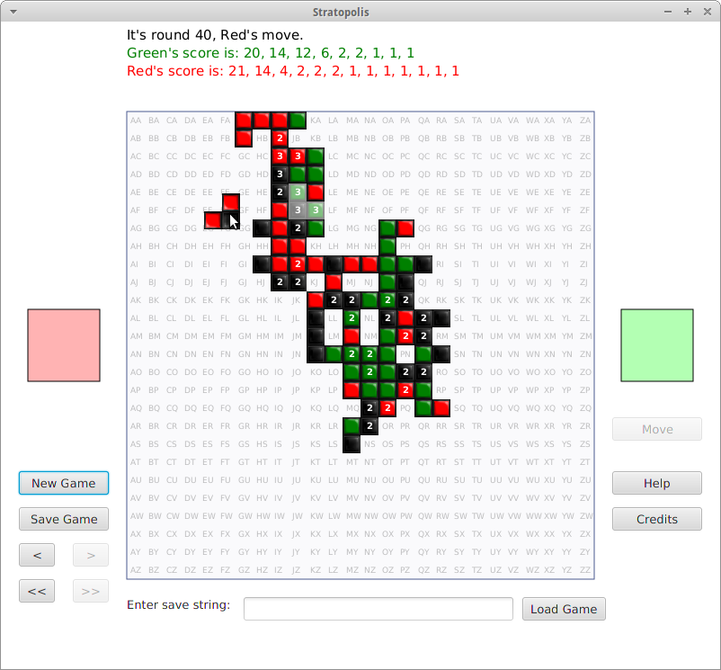

# Stratopolis

This is a Java implementation of the boardgame Stratopolis, written for the [COMP1140 course in Australian National University, 2016](https://web.archive.org/web/20180514193201/https://programsandcourses.anu.edu.au/2016/course/COMP1140). The assignment started with a code template, upon which I coded the rest.

Implemented in Java and JavaFX.

Example screenshot: 

### File structure

* [`original_description.md`](original_description.md): The original `README.md`. A detailed description of the game Stratopolis and the assignment requirements.
*  `game.jar`: The game. Requires the [Java 8 Runtime Environment](https://java.com/en/download/).

* [`src`](src): Folder of the Java source code.
* [`presentation`](presentation): Folder containing the final presentation slides and the LaTeX files used to generate it.