# COMP1140 Assignment 2

*This assignment is only for those enrolled in COMP1140.  COMP1110, COMP1510, and COMP6710 students should look [here](https://gitlab.cecs.anu.edu.au/comp1110/comp1110-ass2).*

## Academic Honesty and Integrity

Honesty and integrity are of utmost importance. These goals are *not* at odds with being resourceful and working collaboratively. You *should* be resourceful, you should collaborate within your team, and you should discuss the assignment and other aspects of the course with others taking the class. However, *you must never misrepresent the work of others as your own*. If you have taken ideas from elsewhere or used code sourced from elsewhere, you must say so with *utmost clarity*. At each stage of the assignment you will be asked to submit a statement of originality, either as a group or as individuals. This statement is the place for you to declare which ideas or code contained in your submission were sourced from elsewhere.

Please read the ANU's [official position](http://academichonesty.anu.edu.au/) on academic honesty. If you have any questions, please ask me.

Carefully review the [statement of originality](originality.md) which you must complete.  Edit that statement and update it as you complete each state of the assignment, ensuring that when you complete each stage, a truthful statement is committed and pushed to your repo.

## Purpose

In this assignment you will exercise a number of major themes of the course,
including software design and implemention, using development tools such as
Git and IntelliJ, using JavaFX to build a user interface.  This assignment (for
COMP1140 students) has the addtional purpose of exploring strategies for writing
agents that play games *(there is a guest lecture in week six for 1140 students
that addresses this element of the assignment)*.  Above all, this assignment will
emphasize group work.

## Assignment Deliverables

The assignment is worth 25% of your total assessment, and it will be marked out
of 25. So each mark in the assignment corresponds to a mark in your final
assessment for the course. Note that for some stages of the assignment you 
will get a _group_ mark, and for others you will be _individually_ marked. The
mark breakdown and the due dates are described on the
[deliverables](http://cs.anu.edu.au/courses/COMP1110/deliverables.html) page.

Your work will be marked via your tutor accessing git, so it is essential that
you carefully follow instructions for setting up and maintaining your group
repository. At each deadline you will be marked according to whatever is
committed to your repository at the time of the deadline. You will be assessed
on how effectively you use git as a development tool.

## Problem Description

The assignment involves implementing in Java a two player-abstract strategy game
called [Stratopolis](http://boardgamegeek.com/boardgame/125022/stratopolis)
made by the French games developer [Gigamic](http://en.gigamic.com).  Board game geek has an [overview](http://boardgamegeek.com/boardgame/125022/stratopolis),
including a handful of videos.  Among them is [one from the
maker](https://www.youtube.com/watch?v=Y3pDbAqc2S4), a [review](https://www.youtube.com/watch?v=LeAi5WBQ7Is) 
and a [tutorial](https://www.youtube.com/watch?v=TWaSDPo5cx4) in Spanish.

The rules for placing tiles are sparingly illustrated [here](http://3.bp.blogspot.com/-IlxDFOX6wbE/UG2LzhuO90I/AAAAAAAAEZk/ra6ctPelXNc/s400/s2.png), 
and scoring is illustrated [here](http://3.bp.blogspot.com/-kOFb01Yoip8/UG2MAHYGwDI/AAAAAAAAEZs/6ACKpM-oje0/s400/s3.png).

We will play the game with a few minor modifications:
* Play will be limited to a 26 x 26 board.
* Every game begins with the move `MMUA` (described below), which places the 
  two-square starting piece in the center of the board.  This is immediately
  followed by a move for green.
* Each player's deck will be shuffled with the top tile revealed (so as soon as
  a tile is played, both players will see the next tile on the deck).
* Ties will be broken according to the value of the next largest region;
  cascading to smaller regions if ties persist; and ultimately to a random
  choice in the unlikely event that it remains unbroken.

#### Objective 

The objective is to place tiles in such a way as to maximize your score at the end of 
the game.   Your score is calculated by finding the largest
region of contiguous squares of your color (when viewed from above), and then multiplying
the number of squares forming the region  by the maximum height of tiles in the region.
Aside from the special starting tile (which has two squares), each tile is made up of three squares, which are 
either red, green or black (black is neutral).

The following diagram illustrates a game after tiles have been placed.

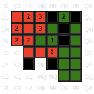

The following sequence shows the progression of the opening play and subsequent
moves that led to the play above.  The black numbers indicate the height of the
tiles (height one is not shown).

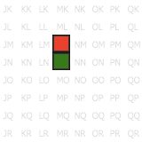
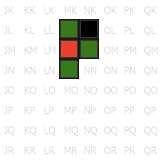
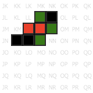
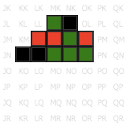
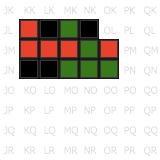
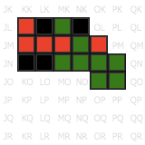
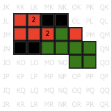
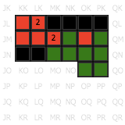
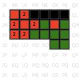
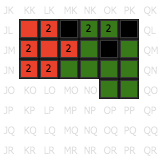
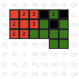
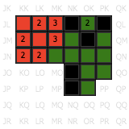
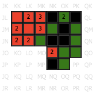
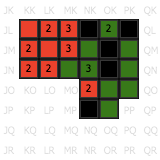
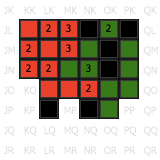

#### Tiles

The game comprises one special two-square starting tile and 40 three-square playing
tiles, 2x10 for each player.  The green player's tiles are dominated by green
squares and the red player's tiles are dominated by red squares.

The starting tile, 'U':
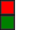

The red player's ten tile types, 'A'-'J' (they recieve two of each):

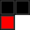
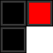
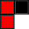
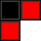

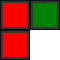
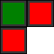
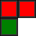
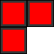

The green player's ten tile types, 'K'-'T' (they recieve two of each):
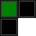
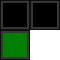
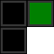
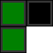
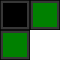
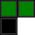
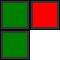
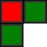
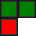
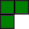

Each tile's position is described in terms of its origin, which is the top
left-most square when in its unrotated state (as illustrated above).

#### Encoding Game State

Game states are encoded as strings.  Your game will need to be able to initialize
itself using these strings and some of your tasks relate directly to these strings.
For example, the sixteen moves of the incomplete game described above are described   by the 
string `MMUANLOBLNBCONSCKLDAPOTCMLEBPLMBKNJDOLNBMLDANPLDNNBAONMCLOFAPQTC`.

##### Placement Strings

A placement string consists of 
between 1 and 41 (inclusive) **piece placements**. The placement string must:
* start with the `U` piece at location `MM`, with rotation `A`;
* follow with a green tile, and then alternate between green and red; and
* only include each tile type at most twice.

##### Tile Placement Strings

A tile placement string consists of four characters describing the location 
and orientation of a particular tile on the board:

* The first character identifies the column in which the origin of the tile is placed ('A' to 'Z').
* The second character identifies the row in which the origin of the tile is placed ('A' to 'Z').
* The third character identifies which of the twenty-one tile-types is being placed ('A' to 'U').
* The fourth character identifies which orientation the tile is in ('A' to 'D').

The image above shows the placement `MMUANLOB`, which places the `U` tile 
at location `MM` in its default rotation, and the `O` tile 
at location `NL` in the `B` rotation, which means rotated 90 degrees clockwise.

##### Legal Tile Placements

Tiles must be placed according to the [rules](http://3.bp.blogspot.com/-IlxDFOX6wbE/UG2LzhuO90I/AAAAAAAAEZk/ra6ctPelXNc/s400/s2.png)
of the game, with the additional constraint that no part of the tile may extend
beyond the 26x26 square playing board:
*  Tiles may be placed adjacent to any other tile (edge touching edge).
* When tiles are stacked:
  * Green and red cannot be stacked on top of each other.
  * Black (neutral) can be stacked with green and red.
  * Each color may be stacked on top of itself.
  * Each square of the tile must be stacked upon a square below (no overhangs allowed).
  * Each stacked tile must straddle at least two tiles below.
  
In the illustrations above, the height of the tiles is indicated with a black number.

##### Scoring

Each player's score is calculated as follows:
* The largest region of connected (edge-to-edge) tiles of the player's color is found.
  (If multiple regions share the same maximial size, then the region among them which
  has the highest point is chosen.)
  Connections are as seen from above, so when determining the size of the region, it does not matter which level the tiles 
  are on.
* The highest point in the maximal region is established.
* The player's score is the size of the region multiplied by the region's greatest
  height.
  
In the game state illustrated here:

Red's largest region has 11 squares (all of their tiles
are in a single region).  Green's largest region is at lower left and has 8 squares.
The maximum height of red's largest region is 3, while the maximum height of 
green's largest region is 1.  Therefore, at this point in the game, red's score
is 11 x 3 = 33, and green's score is 8 x 1 = 8.

## Legal and Ethical Issues

First, as with any work you do, you must abide by the principles of [honesty and integrity](http://academichonesty.anu.edu.au). I expect you to demonstrate honesty and integrity in everything you do.

In addition to those ground rules, you are to follow the rules one would normaly be subject to in a commercial setting. In particular, you may make use of the works of others under two fundamental conditions: a) your use of their work must be clearly acknowledged, and b) your use of their work must be legal (for example, consistent with any copyright and licensing that applies to the given material). *Please understand that violation of these rules is a very serious offence.*  However, as long as you abide by these rules, you are explicitly invited to conduct research and make use of a variety of sources. You are also given an explicit means with which to declare your use of other sources (via originality statements you must complete). It is important to realize that you will be assessed on the basis of your original contributions to the project. While you won't be penalized for correctly attributed use of others' ideas, the work of others will not be considered as part of your contribution. Therefore, these rules allow you to copy another student's work entirely if: a) they gave you permission to do so, and b) you acknowledged that you had done so. Notice, however, that if you were to do this you would have no original contribution and so would recieve no marks for the assigment (but you would not have broken any rules either).

## Evaluation Criteria

It is essential that you refer to the [deliverables page](http://cs.anu.edu.au/courses/COMP1110/deliverables.html) to check that you understand each of the deadlines and what is required.   Your assignment will be marked via git, so all submittable materials will need to be in git and in the *correct* locations, as prescribed by the [deliverables page](http://cs.anu.edu.au/courses/COMP1110/deliverables.html).

**The mark breakdown is described on the
[deliverables](https://gitlab.cecs.anu.edu.au/comp1110/comp1110/wikis/deliverables) page.**

### Part One

In the first part of the assignment you will:
* Create a UML model of your *initial* design for the final assignment (Task #2).
* Implement parts of the text interface to the game (Tasks #3, #4, and #6).
* Implement a simple viewer that allows you to visualise game states (Task #5).

The criteria for the [completion of part one](https://gitlab.cecs.anu.edu.au/comp1110/comp1110/wikis/deliverables#d2c-assignment-2-stage-c-2-marks-group)
is as follows:

**Pass**
* Tasks #2, #3 and #4.

**Credit**
* Task #5 *(in addition to all tasks required for Pass)*.

**Distinction**
* Task #6 *(in addition to all tasks required for Credit)*.

### Part Two

Create a fully working game using JavaFX to implement a playable graphical version
of the game in a 960x720 window.  Your game will be able to play against a
human or another computer.

Notice that aside from the window size, the details of exactly how the game
looks etc, are **intentionally** left up to you.  The diagrams above are for
illustration purposes only.   However, you are provided with images for each
of the twelve pieces which you may use.

The only **firm** requirements are that:

* you use Java and JavaFX,
* the game respects the specification of the game given here,
* the game be easy to play,
* it runs in a 960x720 window, and
* that it is executable on a standard lab machine from a jar file called `game.jar`,

Your game must successfully run from `game.jar` from within another user's (i.e.
your tutor's) account on a standard lab machine (in other words, your game must
not depend on features not self-contained within that jar file and the Java 8 
runtime).

**Pass**
* Correctly implements all of the <b>Part One</b> criteria.
* Appropriate use of git (as demonstrated by the history of your repo).
* Completion of Task #7.
* Executable on a standard lab computer from a runnable jar file, game.jar, which resides in the root level of your group repo.

**Credit**
* _All of the Pass-level criteria, plus the following..._
* Task #8.

**Distinction**
* _All of the Credit-level criteria, plus the following..._
* Tasks #9, #10 and #11.

**High Distinction**
* _All of the Distinction-level criteria, plus the following..._
* Task #12.
